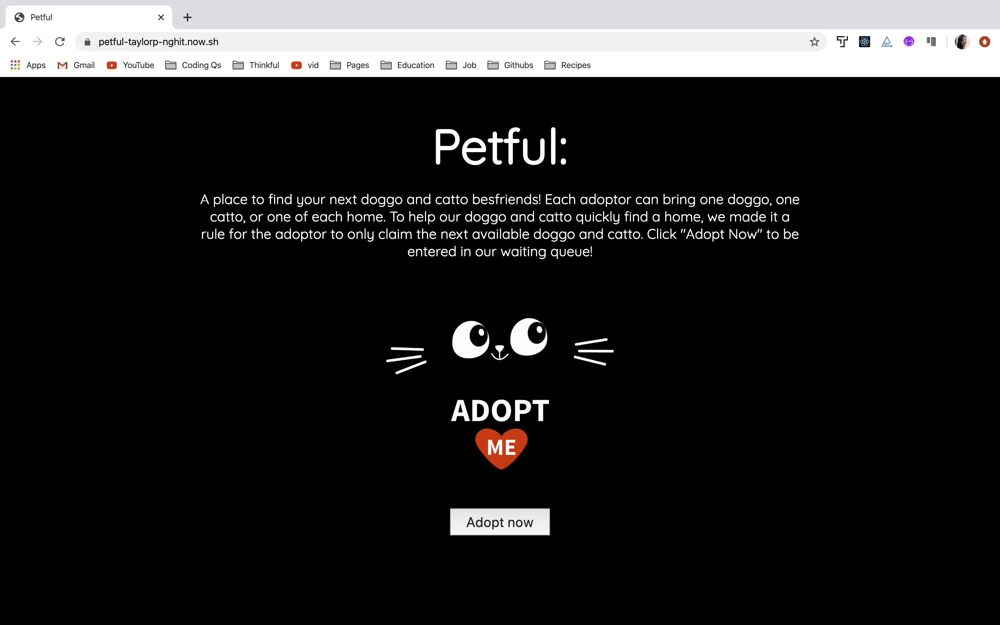

# Petful Client

A pet adoption interface where users can adopt cats and dogs. Users have to enter a waiting queue in order to wait for their turn to adopt. Pets are also adopted based on the FIFO (first in first out) method where the first rescued pets are the next to get adopted.

## Live Link

https://petful-taylorp-nghit.now.sh/

## Authors

- Nghi Tran
- Taylor Piccarreto

## Tech Stack

- React
- Javascript
- HTML
- CSS

### API

https://github.com/thinkful-ei-jaguar/petful-server-NghiTaylorP
https://petful-server-nhgi-taylorp.herokuapp.com/api

